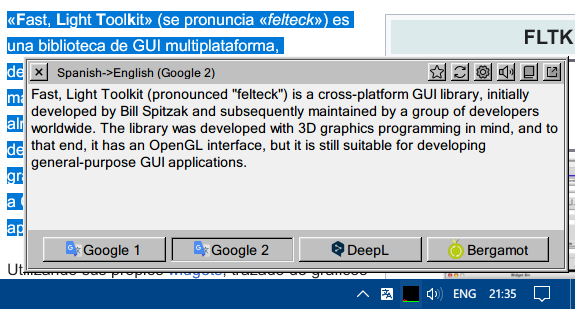
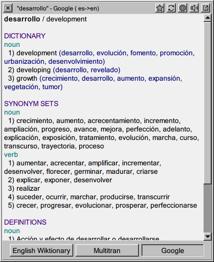
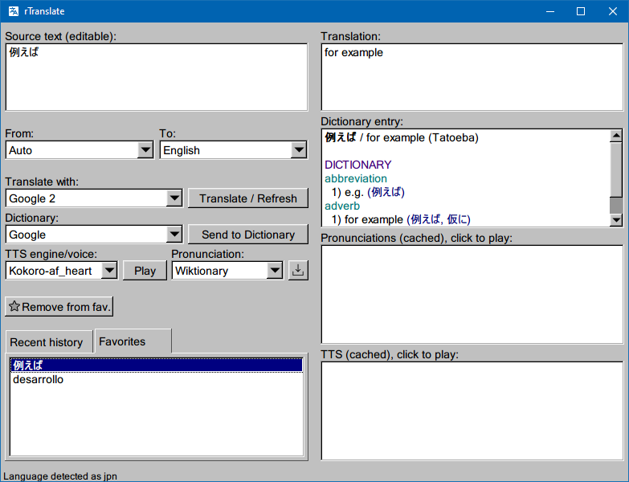
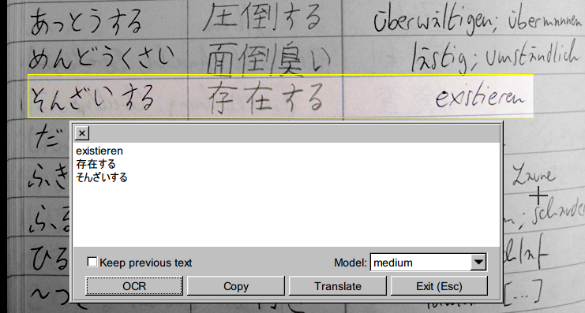

# rTranslate

Yet another replacement for abandoned QuestSoft QTranslate. Lightweight (6-25 MB RAM footprint). Local offline translation, OCR and TTS supported (bergamot with firefox models and kokoro.js through Deno's runtime).

## Features

- **Instant Translation:** Select text in any application and instantly translate it using a customizable shortcut.
- **Screen OCR:** Press a customizable hotkey, select any screen area, and extract text instantly using a local offline OCR engine.
- **Dictionaries:** Google, DSL (local)
- **Translator services:** Google Translate, DeepL, Bergamot (local)
- **Text-to-Speech (TTS):** Kokoro.js (local)
- **Pronunciations:** Google, Wiktionary
- **Extensions:** Supports extensions running as sidecar processes. QTranslate services also supported.
- **History & Favorites**

## Screenshots
  

 

## Default global hotkeys
- **Translate the selected text:** Ctrl + Q
- **Dictionary:** Ctrl + Shift + Q
- **OCR:** Ctrl + `

## Roadmap

- [x] Offline OCR (PaddleOCR)
- [ ] QTranslate services support
	- [x] translation
	- [ ] dictionaries
	- [ ] tts
- [ ] Wiktionary parser
- [x] i18n
- [ ] Double-key shortcuts, mouse mode
- [ ] High-DPI and multi-monitor setups support
- [x] Windows 7, XP support
- [ ] Builds for Linux
- [ ] Codebase refactoring

## Installation

Fully portable. Run install_extensions.bat to download the kokoro and bergamot models.

## Building

See GitHub Actions workflow.

## Some of the 3rd party content (esp. with required attribution) used in this repo:

- **bergamot-translate:** github.com/browsermt/bergamot-translator
- **kokoro-js:** github.com/hexgrad/kokoro
- **oggenc2:** rarewares.org/ogg-oggenc.php
- **QuickJS:** bellard.org/quickjs/binary_releases/quickjs-win-i686-2026-06-04.zip
- **Rust PaddleOCR:** models from github.com/zibo-chen/rust-paddle-ocr/tree/de823d33a76eb2123038be27319da74168bdc069/models

**Icons:**
- **CyCraft Pepicons Print collection** Licensed under CC BY 4.0
- **Phosphor Icons** Licensed under MIT
- **Lets Icons** by Leonid Tsvetkov. Licensed under CC BY 4.0
- **CoreUI Free** by creativeLabs Łukasz Holeczek. Licensed under CC BY 4.0 License
- **IconPark Outline** by ByteDance. License: Apache 2.0
